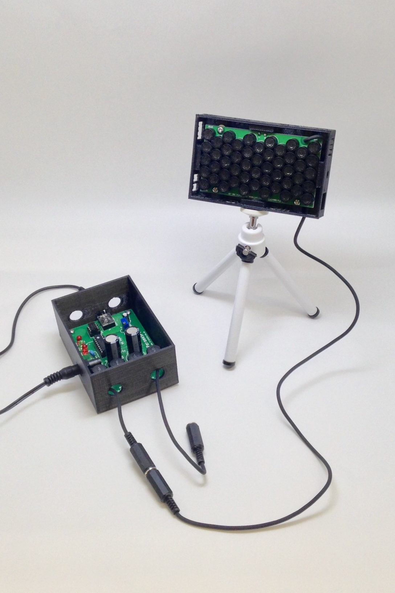
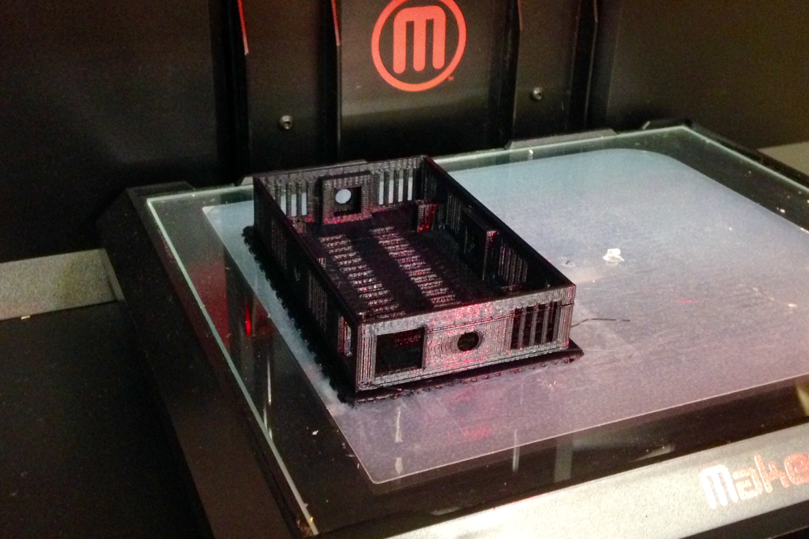
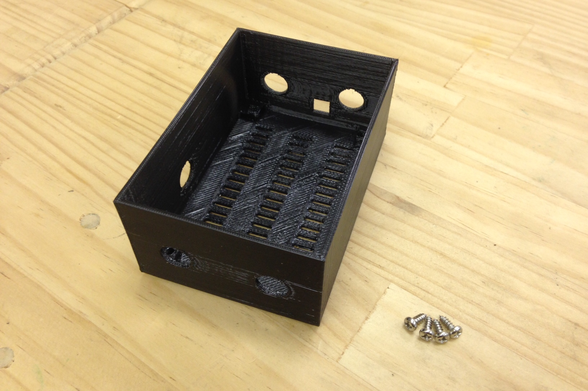
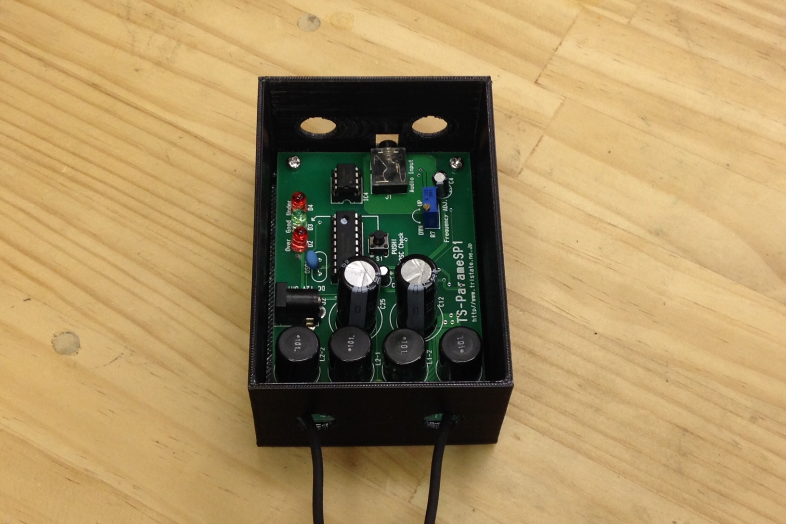
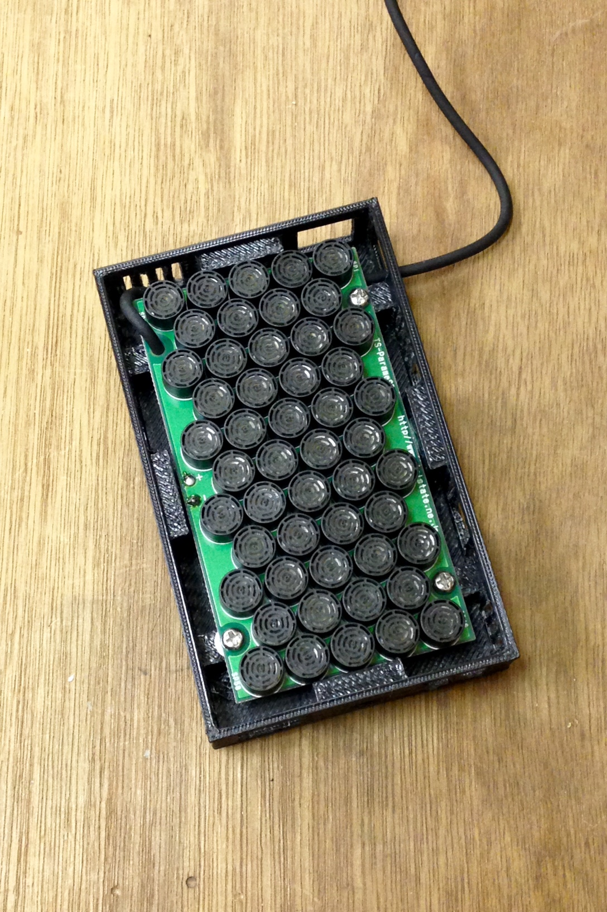
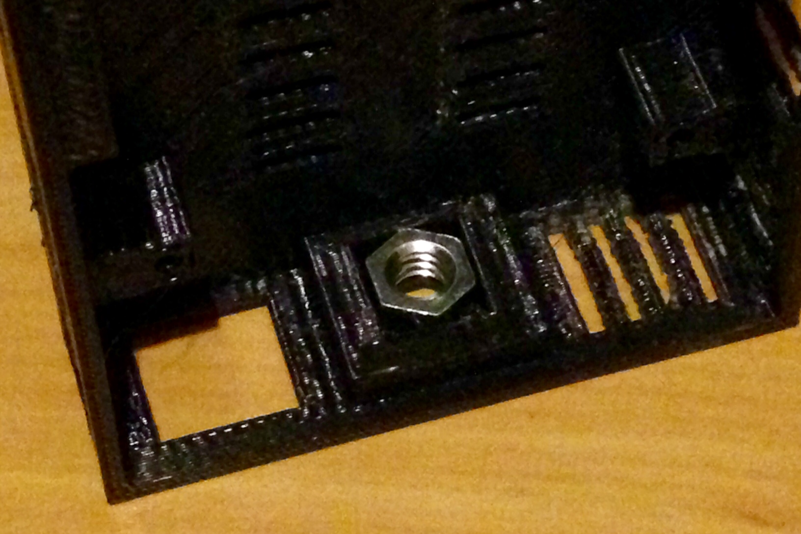
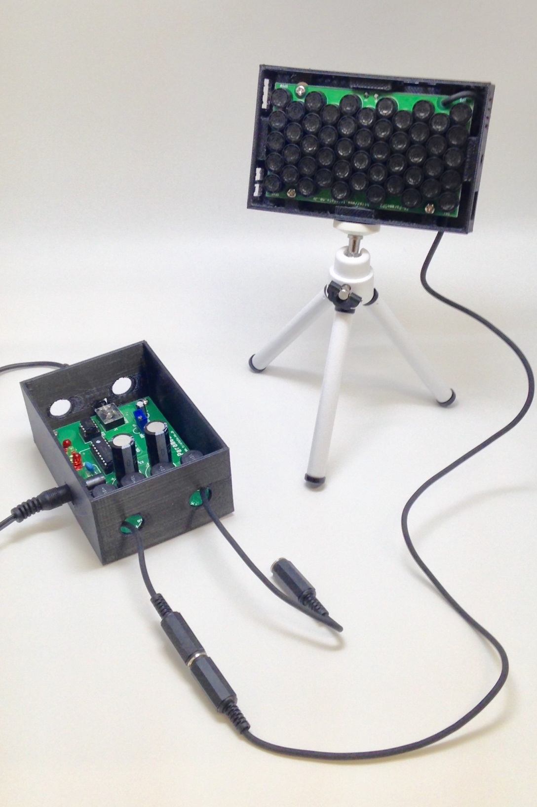

#Parametric Speaker Case

  

###Goal:  

- to Make Case for Parametric Speaker by TriState  
- for Speaker Unit and AMP Unit.  
  
	[Parametric Speaker (Single-directional Speaker) Test Kit (TriState)](http://www.tristate.ne.jp/parame.htm)  

###How to Make:  
  
- download stl files and print them.    
  
  
  
- put AMP Unit and screw with M3x8 screw.   
  
    
  
    
  
- put Speaker Unit and screw with M3x8 screw.  
  
   
  
- put 1/4 nut on Speaker Case for tripod (depends).    
  
   
  
- finish!!  
  
  
  
  

###Licenses and Credits  

 Parametric Speaker Case (stl files) produced by yosuke sakai is licensed under a  <a rel="license" href="http://creativecommons.org/licenses/by-sa/4.0/">Creative Commons Attribution-ShareAlike 4.0 International License</a>.
